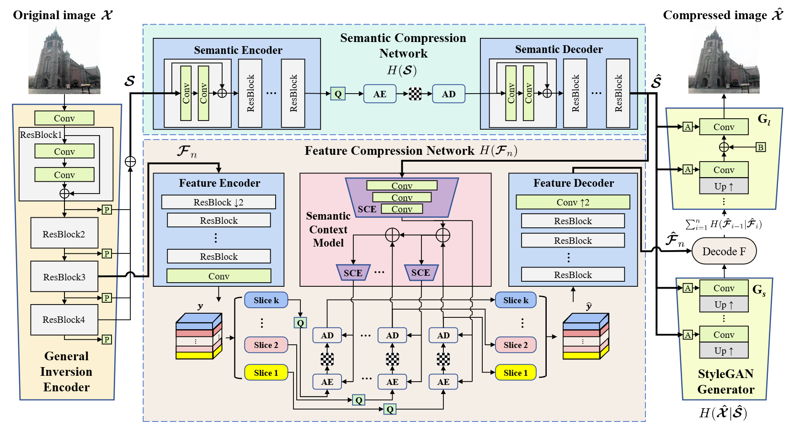

## Hierarchical Semantic Compression for Consistent Image Semantic Restoration

> Shengxi Li, [Zifu Zhang](https://github.com/bblgbr), Mai Xu, Lai Jiang, Yufan Liu, Ce Zhu<br>
> :partying_face: This work is accepted by IEEE Transaction on Image Processing.

<p align="center">
    <br>
</p>

### :book: Table Of Contents
- [:computer: Train](#computer-train)
- [:zap: Inference](#inference)
- [:heart: Acknowledgement](#acknowledgement)
- [:clipboard: Citation](#cite)

### :wrench: Requirements

```bash
- conda create -n HSC python==3.8
- conda activate HSC
- pip install -r requirements.txt
- pip install compressai
```

### <a name="train"></a>:computer: Train

1. Prepare the training dataset and change the path in `./configs/xxx.yaml`.

```
   save_folder
   ├── train # train dataset
   └── test # test dataset
```

To train the encoder for StyleGAN, we use the synthetic images generated by StyleGAN and also the real images [ffhq dataset](https://github.com/NVlabs/ffhq-dataset).
You can generate the synthetic images by running

```bash
python generate_imgs.py
```

2. Prepare StyleGAN2 model and other necessary models

```bash
    sh download_models.sh
```

3. Run the following command and change the corresponding config and dataset path.

```bash
# First stage: train the inversion encoder
   python train_stage1.py --config 20241103_idx3_lambda005 --type face --real_dataset_path xxx --dataset_path xxx
# Second stage: train the compression network
   python train_stage2.py --config 20241103_idx3_lambda005 --type face --real_dataset_path xxx --dataset_path xxx
```

### <a name="inference"></a>:zap: Inference

1. Download the checkpoints into `./experiment`.

    | lambda   | lambda | Link |
    | --------- | ------------------ |----------- |
    | face  | {0.02, 0.03, 0.05, 0.15} | [checkpoint](https://bhpan.buaa.edu.cn/link/AAAC3E377EB85D4E128404740C29CF971C)             |
    | car  | {0.02, 0.07, 0.15, 0.4} | [checkpoint](https://bhpan.buaa.edu.cn/link/AAAC3E377EB85D4E128404740C29CF971C)             |
    | church  | {0.01, 0.02, 0.05, 0.07} | [checkpoint](https://bhpan.buaa.edu.cn/link/AAAC3E377EB85D4E128404740C29CF971C)              |

2. Run the following command.

```bash
python test_compressor.py --type car --config car_stage2 \
--checkpoint ./experiments/car_idx3_channel8_lamb04_checkpoint.pth \
--input_path ./data/car/ \
--save_path ./output/car_idx3_channel8_lamb04/

python test_compressor.py --type face --config face_stage2 \
--checkpoint ./experiments/face_idx5_channel8_lamb003_checkpoint.pth \
--input_path ./data/celeba_hq/ \
--save_path ./output/face_idx5_channel8_lamb003_checkpoint/
```

### <a name="Editing"></a>:star: Editing

Run the following command to edit face images and car images.

```bash
python edit_face_compress.py --config face_stage2 --checkpoint /experiments/face_idx5_channel8_lamb003_checkpoint.pth --input_path ./data/celeba_hq_5k/ --save_path ./output/face_idx5_channel8_lamb003_checkpoint_edit/ --edit Eyeglasses

python edit_car_compress.py --config car_stage2 --checkpoint ./experiments/car_idx3_channel8_lamb04_checkpoint.pth --input_path ./data/car/ --save_path ./output/car_idx3_channel8_lamb04_checkpoint_edit --edit Viewpoint_II 

```

### <a name="acknowledgement">:heart: Acknowledgement
This work is based on [Compressai](https://github.com/InterDigitalInc/CompressAI) and [FeatureStyleEncoder](https://github.com/InterDigitalInc/FeatureStyleEncoder), thanks to the invaluable contributions.

## <a name="cite"></a>:clipboard: Citation

Please cite us if our work is useful for your research.

```
@article{li2025hierarchical,
  title={Hierarchical Semantic Compression for Consistent Image Semantic Restoration},
  author={Li, Shengxi and Zhang, Zifu and Xu, Mai and Jiang, Lai and Liu, Yufan and Zhu, Ce},
  journal={arXiv preprint arXiv:2502.16799},
  year={2025}
}
```